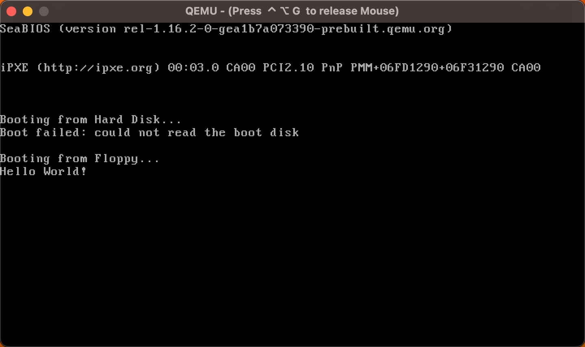

## Hello World!

<p align="center">
    
</p>

We will start the NewbieOS tutorial series by building a simple OS which prints "Hello World!".

### Tools

Before we start, here are the tools we will use:

- Code editor
- Makefile
- Assembler
- Virtualization software

### Let's Start!

First and foremost, we have to write an assembly code to perform legacy booting: BIOS loads first sector of each bootable device into memory (at location 0x7C00) and starts executing the code if 0xAA55 signature is found

To achieve this, our assembly code needs to perform the following:
- Set base address to be 0x7C00
- Set bit to be 16-bit (Optional, to make it compatible for older processor)
- Keep program in a loop
- Pad the program to be 512 bytes
- Emit 0xAA55 signature

To make dev and build easier, it is also recommeded to use Makefile and follow the file structure below
- `build`
- `src`
     - `main.asm`
- `Makefile`

Now, we can make a simple OS which prints "Hello World!". Building on our bootloader program, we need to add the following commands:
- Set up base address of registers ds, es and ss to be 0 and sp to be 0x7C00 (the start of OS, this is because stack grows downwards and thus, if we set sp address to be the end of OS it will overwrite the OS)

Sample code snippet:
```assembly
    mov ax, 0 
    mov ds, ax 
    mov es, ax 

    mov ss, ax
    mov sp, 0x7C00 
```

- Create a subroutine for printing "Hello World!". The general idea of this subroutine is as follow:
    - Create a "Hello World!" variable and save it to register si
    - Push si to the stack
    - Load each character
        - If character is not null, call interrupt to print it to the screen and loop through this step
        - If null break the loop
    - Pop si from the stack

Sample code snippet:
```assembly
%define ENDL 0x0D, 0x0A
msg_hello: db 'Hello World!', ENDL, 0

puts:
    mov si, msg_hello
    push si

.loop:
    lodsb
    or al, al
    jz .done

    mov ah, 0x0e
    mov bh, 0 
    int 0x10

    jmp .loop

.done:
    pop si
    ret
```