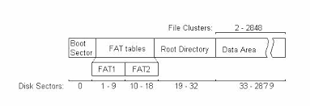

## Building FAT12 Filesystem

### Why do we need a filesystem (fs)?

As shown in the previous parts, you can actually find a file without having a filesystem.
However, just imagine if you want to find a random book in a heap of books, it would be
very hard to find it. But what if we have an organizer that would allow us to locate the book
quickly, like a book classification system in the library, this would allow us to find the book easily.
This is the exact role of a file system.

### FAT12 Filesystem

In this `NewbieOS`, we are using FAT12 filesystem, which is a fs developed for MS-DOS and Windows 9x OS which were
released
around ~1981. It is an old fs, but it is one of the simplest fs that is still used nowadays, usually for embedded
devices.

#### Specification

1. The basic specification of FAT12 can be found [here](https://wiki.osdev.org/FAT) while the full specs can be found in
   the Microsoft FAT Specification pdf in the same folder as this document.
2. TLDR; the FAT12 fs has 4 areas which are boot sector, FAT sector, root directory sector and data area as shown in the
   following images.

<p align="center">
    
</p>

3. To find a file, we need to search the root directory that contains tons of 32-bit entries, and then once the matching
   entry is found, traverse the data using the FAT table.

#### Implementation in C

A proof of concept written in C can be found here:

```C
bool readFile(DirectoryEntry* fileEntry, FILE* disk, uint8_t* outputBuffer)
{
    bool ok = true;
    uint16_t currentCluster = fileEntry->FirstClusterLow;

    do {
        uint32_t lba = g_RootDirectoryEnd + (currentCluster - 2) * g_BootSector.SectorsPerCluster;
        ok = ok && readSectors(disk, lba, g_BootSector.SectorsPerCluster, outputBuffer);
        outputBuffer += g_BootSector.SectorsPerCluster * g_BootSector.BytesPerSector;

        uint32_t fatIndex = currentCluster * 3 / 2;
        if (currentCluster % 2 == 0)
            currentCluster = (*(uint16_t*)(g_Fat + fatIndex)) & 0x0FFF;
        else
            currentCluster = (*(uint16_t*)(g_Fat + fatIndex)) >> 4;

    } while (ok && currentCluster < 0x0FF8);

    return ok;
}
```

Note:

1. `g_` denotes global variables
2. The `& 0x0FFF` and `>> 4` are required because each entry in the FAT is 12-bit long, since we can only read in unit
   of bytes (1 byte = 8 bits), hence we need to adjust the current cluster accordingly

### Translation to Assembly

Having written our code in C and tested them, we need to translate them into assembly. However, it would be a good idea
to split the operating system into two parts now, the bootloader and the kernel. The hardware will automatically load
the bootloader and then using our simple FAT12 fs, we could locate the kernel by name and load them into the memory.

The code is pretty long but the important part is pasted here:

```assembly
.search_kernel:
    mov si, file_kernel_bin
    mov cx, 11                          ; compare up to 11 characters
    push di
    repe cmpsb
    pop di
    je .found_kernel

    add di, 32
    inc bx
    cmp bx, [bdb_dir_entries_count]
    jl .search_kernel

    ; kernel not found
    jmp kernel_not_found_error

.found_kernel:

    ; di should have the address to the entry
    mov ax, [di + 26]                   ; first logical cluster field (offset 26)
    mov [kernel_cluster], ax

    ; load FAT from disk into memory
    mov ax, [bdb_reserved_sectors]
    mov bx, buffer
    mov cl, [bdb_sectors_per_fat]
    mov dl, [ebr_drive_number]
    call disk_read

    ; read kernel and process FAT chain
    mov bx, KERNEL_LOAD_SEGMENT
    mov es, bx
    mov bx, KERNEL_LOAD_OFFSET

.load_kernel_loop:
    
    ; Read next cluster
    mov ax, [kernel_cluster]
    
    ; not nice :( hardcoded value
    add ax, 31                          ; first cluster = (kernel_cluster - 2) * sectors_per_cluster + start_sector
                                        ; start sector = reserved + fats + root directory size = 1 + 18 + 134 = 33
    mov cl, 1
    mov dl, [ebr_drive_number]
    call disk_read

    add bx, [bdb_bytes_per_sector]

    ; compute location of next cluster
    mov ax, [kernel_cluster]
    mov cx, 3
    mul cx
    mov cx, 2
    div cx                              ; ax = index of entry in FAT, dx = cluster mod 2

    mov si, buffer
    add si, ax
    mov ax, [ds:si]                     ; read entry from FAT table at index ax

    or dx, dx
    jz .even

.odd:
    shr ax, 4
    jmp .next_cluster_after

.even:
    and ax, 0x0FFF

.next_cluster_after:
    cmp ax, 0x0FF8                      ; end of chain
    jae .read_finish

    mov [kernel_cluster], ax
    jmp .load_kernel_loop

.read_finish:
    
    ; jump to our kernel
    mov dl, [ebr_drive_number]          ; boot device in dl

    mov ax, KERNEL_LOAD_SEGMENT         ; set segment registers
    mov ds, ax
    mov es, ax

    jmp KERNEL_LOAD_SEGMENT:KERNEL_LOAD_OFFSET
```

Note:

1. There are many `x86` instructions that are not really obvious, I would recommend you to check
   this [out](https://en.wikipedia.org/wiki/X86_instruction_listings#:~:text=The%20x86%20instruction%20set%20refers,and%20executed%20on%20the%20processor.)
   or ask ChatGPT to spit out what each instruction do :")
2. The main idea that this piece of code does is that it would try to find the kernel by comparing the name of the file.
   Once found, it will load the kernel to `KERNEL_LOAD_SEGMENT:KERNEL_LOAD_OFFSET` by following the logic that has been
   written in C. Once we have finished loading the kernel, we jump into that kernel.

That's the main idea of filesystem :) Of course there are too many details to be covered here, but I hope this would
give the general picture why and how FAT12 is being implemented and used for our operating system.